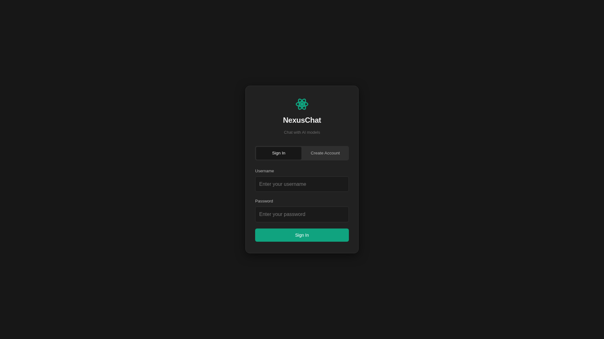
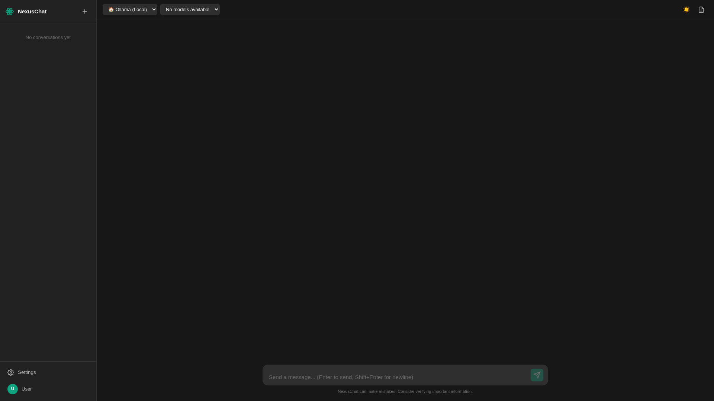
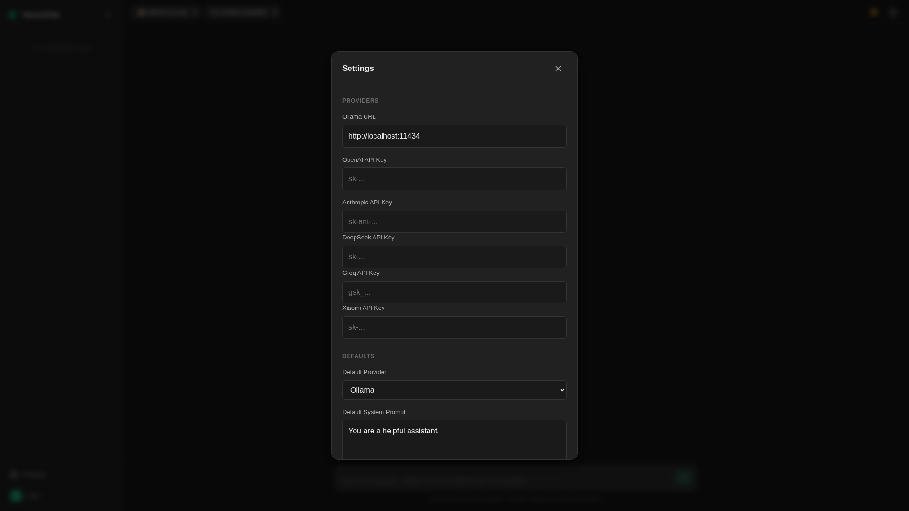
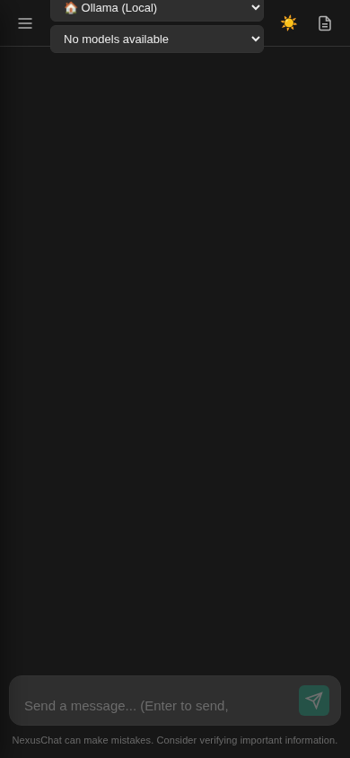

<div align="center">


# NexusChat

**A modern, open-source ChatGPT-like web interface for local and cloud AI models**

*Supports Ollama, OpenAI, Anthropic, DeepSeek, Xiaomi MiMo, and Groq with real-time streaming*

[](LICENSE)
[](https://python.org)
[](https://fastapi.tiangolo.com)

</div>

---

## ✨ Features

- 🤖 **Multi-Provider** — Ollama (local), OpenAI, Anthropic, DeepSeek, Xiaomi MiMo, Groq
- ⚡ **Real-time Streaming** — Token-by-token SSE streaming with stop generation
- 💬 **Conversation Management** — Persistent chat history with SQLite
- 🎨 **Dark/Light Theme** — Beautiful dark-first UI with theme toggle
- 📝 **Markdown + Code** — Full GFM rendering with syntax highlighting and copy buttons
- 🔧 **System Prompts** — Per-conversation custom system prompts
- 👥 **Multi-User** — Individual accounts with separate settings and API keys
- 🔒 **Secure** — JWT auth, bcrypt passwords, input sanitization
- 📱 **Responsive** — Works on desktop, tablet, and mobile
- ⌨️ **Keyboard Shortcuts** — Ctrl+Enter send, Ctrl+N new chat, Ctrl+B toggle sidebar
- 🏠 **Self-Hosted** — Runs entirely on your machine or deploy to the cloud

## 📸 Screenshots

<div align="center">

### Login


### Chat Interface


### Settings


### Mobile


</div>

## 🚀 Quick Start

### Prerequisites

- Python 3.11+
- [Ollama](https://ollama.ai) (for local models, optional)
- API keys for cloud providers (optional)

### Installation

```bash
git clone https://github.com/abhi-maybe/nexuschat.git
cd nexuschat

# Create virtual environment
python -m venv venv
source venv/bin/activate  # or `venv\Scripts\activate` on Windows

# Install dependencies
pip install -r requirements.txt

# Configure environment
cp .env.example .env
# Edit .env with your API keys
```

### Run

```bash
python main.py
# → http://localhost:8080
```

### Using with Ollama (Local)

```bash
# Install and start Ollama
curl -fsSL https://ollama.ai/install.sh | sh
ollama serve

# Pull a model
ollama pull llama3.2

# NexusChat auto-detects running Ollama
```

### Using with Cloud Providers

1. Open **Settings** (gear icon in sidebar)
2. Enter your API key(s) under **Providers**
3. Select the provider from the dropdown in the top bar
4. Choose a model and start chatting

## 🏗️ Architecture

```
nexuschat/
├── main.py                    # Entry point
├── config.py                  # Configuration (env-based)
├── server/
│   ├── app.py                 # FastAPI application factory
│   ├── routes/
│   │   ├── auth.py            # Register / Login / JWT
│   │   ├── chat.py            # Chat & conversations CRUD
│   │   ├── models.py          # Model listing & provider status
│   │   ├── settings.py        # User settings & API keys
│   │   └── health.py          # Health check endpoint
│   ├── providers/
│   │   ├── base.py            # Abstract provider interface
│   │   ├── ollama_provider.py # Ollama local inference
│   │   ├── openai_provider.py # OpenAI GPT models
│   │   ├── anthropic_provider.py  # Anthropic Claude
│   │   ├── deepseek_provider.py   # DeepSeek
│   │   ├── xiaomi_provider.py     # Xiaomi MiMo
│   │   ├── groq_provider.py       # Groq (fast inference)
│   │   └── registry.py        # Provider discovery & management
│   ├── database/
│   │   ├── models.py          # SQLAlchemy models
│   │   └── manager.py         # Async database manager
│   └── middleware/
│       └── cors.py            # CORS configuration
├── static/
│   ├── css/style.css          # Dark/light theme
│   ├── js/
│   │   ├── app.js             # Main SPA logic
│   │   ├── utils.js           # Utility functions
│   │   └── keyboard.js        # Keyboard shortcuts
│   └── img/
│       ├── logo.svg           # Project logo
│       ├── favicon.svg        # Favicon
│       └── screenshots/       # README screenshots
└── templates/
    ├── index.html             # Chat interface
    └── login.html             # Auth page
```

## 🛠️ Tech Stack

- **Backend:** FastAPI + Uvicorn (async)
- **Database:** SQLite via SQLAlchemy (async)
- **Frontend:** Vanilla JS + Marked.js + Highlight.js
- **Auth:** JWT (python-jose) + bcrypt
- **HTTP Client:** httpx (async)
- **Streaming:** Server-Sent Events (SSE)

## 📡 API Endpoints

| Method | Endpoint | Description |
|--------|----------|-------------|
| POST | `/api/auth/register` | Create account |
| POST | `/api/auth/login` | Get JWT token |
| GET | `/api/auth/me` | Current user info |
| POST | `/api/chat/send` | Send message (streaming) |
| GET | `/api/chat/conversations` | List conversations |
| GET | `/api/chat/conversations/:id` | Get conversation |
| PUT | `/api/chat/conversations/:id` | Update conversation |
| DELETE | `/api/chat/conversations/:id` | Delete conversation |
| GET | `/api/models/available` | List available models |
| GET | `/api/models/status` | Provider availability |
| GET | `/api/settings/` | Get user settings |
| PUT | `/api/settings/` | Update settings |
| GET | `/api/health` | Health check |

## 🔌 Adding New Providers

Implement the `BaseProvider` interface:

```python
from server.providers.base import BaseProvider, ChatMessage

class MyProvider(BaseProvider):
    name = "myprovider"
    display_name = "My Provider"

    async def chat(self, messages, model, **kwargs):
        ...

    async def chat_stream(self, messages, model, **kwargs):
        ...  # yield tokens

    async def list_models(self):
        ...

    async def is_available(self):
        ...
```

Then register in `server/providers/registry.py`.

## 📄 License

MIT License — see [LICENSE](LICENSE)

---

<div align="center">

Made with ❤️ by [Abhi](https://github.com/abhi-maybe)

</div>
